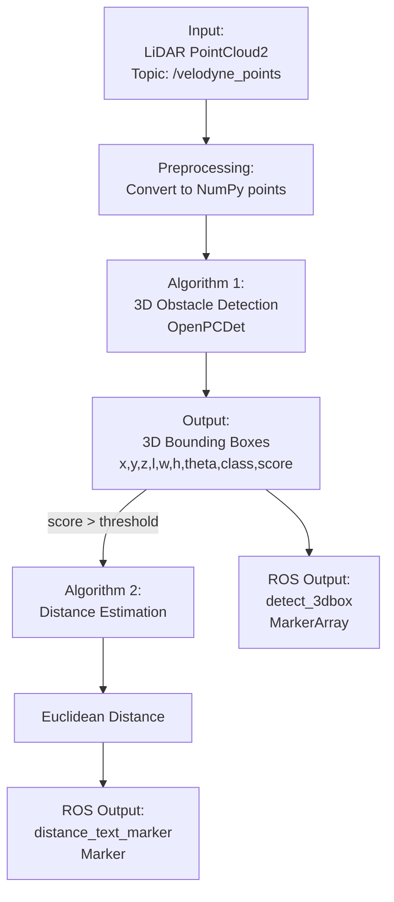

```mermaid
flowchart TD
    A[Input:<br/>LiDAR PointCloud2<br/>Topic: /velodyne_points] --> B[Preprocessing:<br/>Convert to NumPy points]

    B --> C[Algorithm 1:<br/>3D Obstacle Detection<br/>OpenPCDet]
    C --> D[Output:<br/>3D Bounding Boxes<br/>x,y,z,l,w,h,theta,class,score]

    D -->|score > threshold| E[Algorithm 2:<br/>Distance Estimation]
    E --> F[Euclidean Distance]

    %% ROS Outputs
    D --> G[ROS Output:<br/>detect_3dbox<br/>MarkerArray]
    F --> H[ROS Output:<br/>distance_text_marker<br/>Marker]
```